<div align="center">

# 🏥 Medical Data Intelligence Platform

### *Transform Telegram chatter into actionable medical business insights*

[](https://python.org)
[](https://fastapi.tiangolo.com)
[](https://www.getdbt.com)
[](LICENSE)

[Quick Start](#-quick-start) • [Architecture](#-architecture) • [Features](#-features) • [API](#-api-endpoints)

</div>

---

## 🎯 What Does This Do?

Imagine having **instant access** to medical product trends, supplier activities, and market intelligence from Ethiopian Telegram channels—all without lifting a finger. This platform:

```mermaid
graph LR
    A[📱 Telegram] -->|Scrape| B[🔄 ETL Pipeline]
    B -->|Store| C[🗄️ PostgreSQL]
    C -->|Transform| D[⚡ dbt Models]
    D -->|Analyze| E[🤖 YOLOv8 + FastAPI]
    E -->|Insight| F[📊 Analytics Dashboard]
    
    style A fill:#0088cc
    style E fill:#FF6849
    style F fill:#00C853
```



Automatically **scrapes**, **enriches**, and **transforms** medical business data from Telegram into a production-ready data warehouse with REST APIs.

---

## ✨ Features

<table>
<tr>
<td width="50%">

### 🔍 Smart Data Collection
- Auto-scrapes Telegram channels
- Extracts messages + media
- Handles rate limits gracefully

### 🧠 AI-Powered Analysis
- YOLOv8 object detection on images
- Product mention tracking
- Trend analysis over time

</td>
<td width="50%">

### ⚡ Lightning-Fast APIs
- RESTful endpoints via FastAPI
- CSV export support
- Real-time analytics

### 📊 Data Warehouse
- Star schema design
- dbt-powered transformations
- Full lineage tracking

</td>
</tr>
</table>

---

## 🚀 Quick Start

> **Prerequisites:** Docker, Python 3.10+, Telegram API credentials

### 1️⃣ Setup Environment

```bash
# Clone and navigate
git clone <your-repo-url>
cd Shipping-a-Data-Product-main

# Create .env file
cat > .env << EOF
TELEGRAM_API_ID=your_api_id
TELEGRAM_API_HASH=your_api_hash
POSTGRES_USER=postgres
POSTGRES_PASSWORD=postgres
POSTGRES_DB=medical_data
EOF
```

### 2️⃣ Launch Infrastructure

```bash
docker-compose up -d
```

### 3️⃣ Run the Pipeline

```bash
# Scrape data
python src/scraper.py

# Load to database
python src/json_to_postgres.py

# Transform with dbt
cd dbt/medical_warehouse && dbt run

# Start API server
cd fastapi_app && uvicorn main:app --reload
```

**That's it!** 🎉 Visit `http://localhost:8000/docs` for interactive API documentation.

---

## 🏗️ Architecture

```
.
├── 📦 src/                    # ETL scripts
│   ├── scraper.py            # Telegram data extraction
│   └── json_to_postgres.py   # Database loader
│
├── 🔄 dbt/                    # Data transformation layer
│   └── medical_warehouse/    # dbt project
│       └── models/           # SQL transformations
│
├── 🤖 yolo_detection/         # AI image analysis
│
├── ⚡ fastapi_app/            # REST API server
│
├── 📊 notebooks/              # Analytics & visualizations
│
└── 🐳 docker-compose.yml      # Infrastructure as code
```

---

## 🌐 API Endpoints

### Core Analytics

| Endpoint | Description | Example |
|----------|-------------|---------|
| `GET /api/products/top` | Top mentioned medical products | `?limit=10` |
| `GET /api/reports/visual-content` | Image detections with context | `?csv=true` |
| `GET /api/channels/activity` | Channel activity metrics | `?date=2024-01` |

### Example Response

```json
{
  "product": "Paracetamol",
  "mentions": 342,
  "trend": "+15%",
  "channels": ["MedSupply_ET", "PharmaHub"]
}
```

---

## 🛠️ Tech Stack

<div align="center">

| Layer | Technology |
|-------|-----------|
| **Data Ingestion** | Telethon (Telegram API) |
| **Storage** | PostgreSQL |
| **Transformation** | dbt Core |
| **ML/AI** | YOLOv8 (Ultralytics) |
| **API** | FastAPI |
| **Orchestration** | Dagster |
| **Infrastructure** | Docker Compose |

</div>

---

## 📈 Sample Insights

<details>
<summary>💊 <b>Top 10 Medical Products</b></summary>

Generated dynamically from Telegram mentions with trend analysis.

</details>

<details>
<summary>📸 <b>Media Type Distribution</b></summary>

Pie chart showing text-only vs. image-based messages.

</details>

<details>
<summary>🔗 <b>dbt Lineage Graph</b></summary>

Run `dbt docs serve` to explore the interactive data model lineage.

</details>

---

## 🎯 Use Cases

- **📊 Market Research:** Track product demand and supplier activity
- **🔍 Competitive Analysis:** Monitor competitor pricing and inventory
- **📈 Trend Forecasting:** Identify emerging medical products
- **🤖 Automated Reporting:** Generate weekly insights via API

---

## 🤝 Contributing

This is an active project! Contributions, issues, and feature requests are welcome.

---

<div align="center">


⭐ Star this repo if you find it useful!

</div>